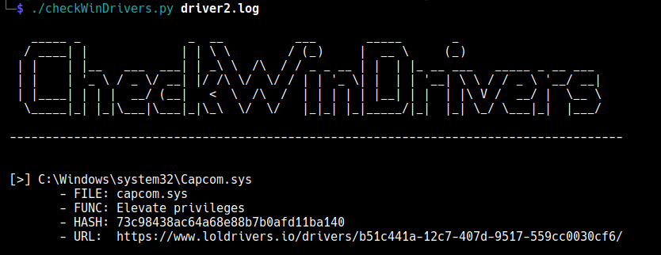

# CheckWinDrivers

*Small script to compare vulnerabilities in a windows system, comparing the MD5 hashes of the drivers against the database of the LOLDrivers project.*

https://github.com/magicsword-io/LOLDrivers

---




### Usage

First, in windows run the following command in powershell to get all the driver files and their hashes.
```powershell
driverquery.exe /v /fo csv | ConvertFrom-CSV | Select-Object 'Path' | ForEach-Object {$out=$_.Path+";";$out+=$(certUtil -hashFile $_.Path MD5)[1] -replace " ","";$out}
```
then copy and paste the output of the command to a file and pass it as a parameter to the script checkWinDrivers.py
```bash
python3 checkWinDrivers.py drivers.log
```
